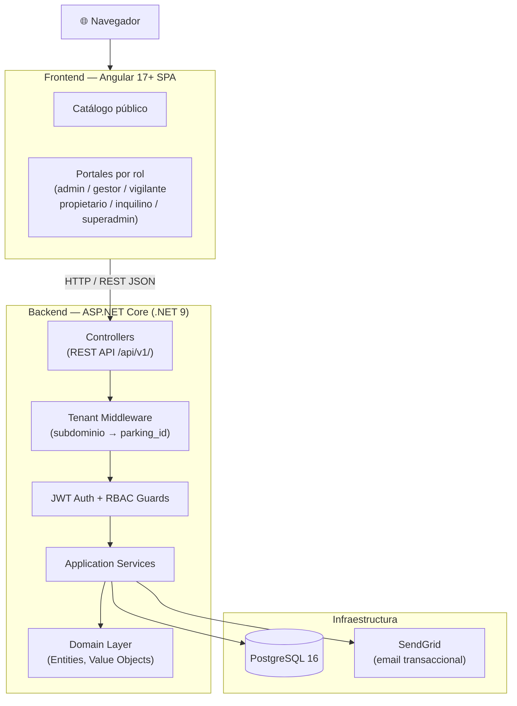
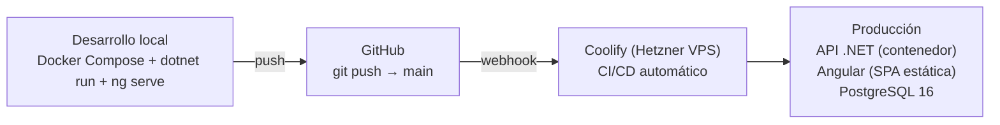
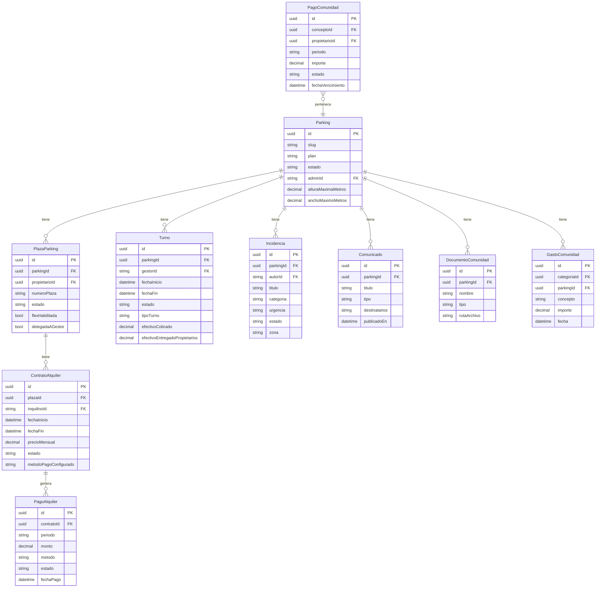

## Índice

0. [Ficha del proyecto](#0-ficha-del-proyecto)
1. [Descripción general del producto](#1-descripción-general-del-producto)
2. [Arquitectura del sistema](#2-arquitectura-del-sistema)
3. [Modelo de datos](#3-modelo-de-datos)
4. [Especificación de la API](#4-especificación-de-la-api)
5. [Historias de usuario](#5-historias-de-usuario)
6. [Tickets de trabajo](#6-tickets-de-trabajo)
7. [Pull requests](#7-pull-requests)

---

## 0. Ficha del proyecto

### **0.1. Tu nombre completo:**

Alexander Molina Perez

### **0.2. Nombre del proyecto:**

ParkingHub

### **0.3. Descripción breve del proyecto:**

Plataforma SaaS multi-tenant para la gestión integral de comunidades de propietarios de plazas de parking. Permite administrar propietarios, inquilinos, contratos de alquiler, pagos, turnos del personal operativo, incidencias y documentación comunitaria desde un único sistema web, con portales diferenciados por rol (ADMIN, GESTOR, VIGILANTE, PROPIETARIO, INQUILINO, SUPER_ADMIN).

### **0.4. URL del proyecto:**

https://github.com/alexcubcn/plazahub

### 0.5. URL o archivo comprimido del repositorio

https://github.com/alexcubcn/plazahub

---

## 1. Descripción general del producto

### **1.1. Objetivo:**

ParkingHub digitaliza la gestión de comunidades de parking que hoy se resuelve con hojas de cálculo, emails y procesos manuales: contratos en papel, cobros sin trazabilidad, incidencias perdidas en grupos de WhatsApp.

El sistema unifica en una sola plataforma web toda la operativa del parking, garantizando que cada usuario ve únicamente lo que le corresponde según su rol. Aporta valor a tres perfiles distintos:

- **Propietarios e inquilinos:** transparencia sobre contratos, pagos y estado de la comunidad.
- **Personal operativo (gestores y vigilantes):** herramientas digitales para turno, cobros e incidencias.
- **Administradores:** control total sobre el parking con reporting y gestión financiera.

### **1.2. Características y funcionalidades principales:**

| Módulo | Funcionalidad |
|---|---|
| **Multi-tenancy** | Cada parking es un tenant independiente, identificado por subdominio. Aislamiento total de datos por `parking_id`. |
| **RBAC — 6 roles** | `SUPER_ADMIN`, `ADMIN`, `GESTOR`, `VIGILANTE`, `PROPIETARIO`, `INQUILINO`. Cada rol tiene portal Angular independiente con rutas protegidas. |
| **Gestión de plazas** | Estados (`DISPONIBLE`, `EN_VENTA`, `ALQUILADA`, `USO_PROPIO`, `MANTENIMIENTO`), fotos, características físicas, plano de planta, delegación al gestor. |
| **Catálogo público** | Portal público de plazas disponibles en alquiler y venta, con filtros por planta/precio, fichas detalladas y formulario de contacto. |
| **Flujo de alquiler** | Solicitud → aprobación ADMIN → contrato → invitación y activación de cuenta del inquilino. |
| **Control de pagos** | Efectivo y Bizum manual. Máquinas de estado por método. Recibos PDF descargables. |
| **Turnos del personal** | Gestor: apertura/cierre con cuadre de caja (efectivo cobrado, entregado, pendiente). Vigilante: turno de vigilancia sin datos financieros. |
| **Incidencias** | Canal de incidencias con categorías (`AVERIA`, `SEGURIDAD`, `LIMPIEZA`, `ACCESO`, `OTRA`), urgencia, adjuntos, comentarios internos y notificaciones por email. Incidencias de seguridad con campo `zona` y prefijo `[SEGURIDAD]` en email. |
| **Finanzas comunitarias** | Cuotas periódicas, derramas, control de morosos, gastos con integridad financiera por mes, fondo económico acumulado. |
| **Comunicaciones** | Comunicados, convocatorias de reunión, actas, documentos comunitarios, directorio de contactos. |
| **Reporting y analytics** | Dashboard con KPIs económicos, ocupación y morosidad. Exportación a Excel (ClosedXML). Gráficas con Chart.js. |
| **Módulos premium** | Feature flags por parking activados solo por `SUPER_ADMIN`: `FLEX`, `BARRERAS`, `REPORTING_AVANZADO`. |

### **1.3. Diseño y experiencia de usuario:**

La aplicación está organizada en portales independientes por rol, cada uno con su propia shell Angular (sidenav + topbar) y rutas lazy-loaded. El acceso a rutas de otro rol redirige automáticamente al portal propio.

> Las capturas de pantalla y videotutorial del flujo completo se incluirán en la **Entrega 2**, una vez validado el entorno de despliegue.

### **1.4. Instrucciones de instalación:**

**Requisitos previos:**
- .NET 9 SDK
- Node.js 18+ y npm
- Docker Desktop (para PostgreSQL local)

**Arranque del entorno completo:**

```bash
# 1. Clonar el repositorio
git clone https://github.com/alexcubcn/plazahub.git
cd plazahub

# 2. Levantar todo el stack con un solo comando
./scripts/dev-up.sh
# Levanta PostgreSQL (Docker), aplica migraciones EF Core,
# arranca la API .NET en puerto 5001 y Angular en puerto 4200.

# Credenciales del superadmin de seed:
# Email:    superadmin@parkinghub.com
# Password: SuperAdmin123!
```

**Comandos individuales (si se prefiere control manual):**

```bash
# Base de datos
docker compose up -d

# Migraciones
dotnet ef database update \
  --project src/ParkingHub.Infrastructure \
  --startup-project src/ParkingHub.Api

# API .NET (puerto 5001)
dotnet run --project src/ParkingHub.Api

# Angular (puerto 4200, con proxy a localhost:5001)
cd plazahub-web && npm install && ng serve
```

**URLs locales:**
- Frontend: http://localhost:4200
- API / Swagger: http://localhost:5001/swagger

---

## 2. Arquitectura del Sistema

### **2.1. Diagrama de arquitectura:**

El backend sigue una arquitectura de **monolito modular**: un único proceso desplegable organizado en cuatro capas con separación estricta de responsabilidades. Se eligió este patrón sobre microservicios para minimizar la complejidad operativa en la fase MVP, manteniendo la posibilidad de extraer módulos en el futuro si el volumen lo justifica.



**Justificación de la arquitectura:**
- **Monolito modular** reduce la latencia entre capas y simplifica el despliegue inicial.
- **Multi-tenancy por columna** (`parking_id`) sobre **shared database** permite escalar el número de tenants sin infraestructura adicional.
- El **Tenant Middleware** centraliza la resolución del tenant; el resto del código nunca necesita conocer el subdominio.

### **2.2. Descripción de componentes principales:**

| Componente | Tecnología | Responsabilidad |
|---|---|---|
| **Web API** | ASP.NET Core 9 | Controladores REST con versionado `/api/v1/`, CORS, middleware global de errores y respuestas estandarizadas `{ data, error }`. |
| **Application Layer** | C# / .NET 9 | Servicios de aplicación con la lógica de negocio. DTOs y contratos de API desacoplados del dominio. |
| **Domain Layer** | C# | Entidades (`AuditableEntity` como base), value objects, constantes de estado. Sin dependencias externas. |
| **Infrastructure Layer** | EF Core 9 + Npgsql | `DbContext`, migraciones Code First, repositorios, `DatabaseSeeder` idempotente, integración SendGrid y QuestPDF. |
| **Angular SPA** | Angular 17+, Angular Material | 7 portales lazy-loaded, standalone components, signals, `roleGuard` por ruta, proxy al backend en desarrollo. |
| **Autenticación** | ASP.NET Identity + JWT | Access token (15 min) + Refresh token rotativo. Claims: `parking_id`, `role`, `user_id`. |

### **2.3. Descripción de alto nivel del proyecto y estructura de ficheros**

```
/
├── src/
│   ├── ParkingHub.Api/              # Entry point. Controllers, Program.cs, middleware
│   ├── ParkingHub.Application/      # Services, DTOs, IEmailService, contratos
│   ├── ParkingHub.Domain/           # Entidades de dominio, value objects, constantes
│   │   ├── Parkings/                # Parking, ModuloParking, ConfiguracionTurnos
│   │   ├── Spots/                   # PlazaParking, ContratoAlquiler, PagoAlquiler, Turno…
│   │   ├── Community/               # Incidencia, Comunicado, PagoComunidad, GastoComunidad…
│   │   └── Garita/                  # VisitaGarita, FranjaGarita, DiaGarita
│   ├── ParkingHub.Infrastructure/   # EF Core DbContext, migraciones, seeders, SendGrid
│   └── ParkingHub.SharedKernel/     # AuditableEntity, interfaces base
├── plazahub-web/                    # Angular SPA
│   └── src/app/
│       ├── admin/                   # Portal ADMIN (10 secciones)
│       ├── gestor/                  # Portal GESTOR
│       ├── vigilante/               # Portal VIGILANTE
│       ├── propietario/             # Portal PROPIETARIO
│       ├── inquilino/               # Portal INQUILINO
│       ├── superadmin/              # Portal SUPER_ADMIN
│       ├── public/                  # Catálogo público (sin autenticación)
│       └── shared/                  # Guards, interceptors, design tokens
├── openspec/                        # Specs, changes y archivo del workflow de desarrollo
├── scripts/                         # dev-up.sh, dev-down.sh
└── docker-compose.yml               # PostgreSQL local
```

El proyecto sigue el patrón **Domain-Driven Design (DDD)** ligero: las entidades de dominio no tienen dependencias de infraestructura, y los servicios de aplicación orquestan el acceso a datos y los efectos secundarios (email, PDF).

### **2.4. Infraestructura y despliegue**



- **Desarrollo:** `./scripts/dev-up.sh` levanta PostgreSQL en Docker, aplica migraciones, arranca API y Angular.
- **Producción:** Hetzner VPS con Coolify como PaaS self-hosted. El push a `main` dispara el pipeline: build de la imagen Docker de la API + build estático de Angular + despliegue con SSL automático vía Let's Encrypt.

### **2.5. Seguridad**

| Práctica | Implementación |
|---|---|
| **Autenticación JWT** | Access token de corta vida (15 min) + Refresh token rotativo almacenado en tabla `RefreshTokens`. Invalidación en logout. |
| **RBAC granular** | Cada endpoint declara `[Authorize(Roles = "...")]`. El guard Angular `roleGuard` protege las rutas del SPA. |
| **Aislamiento multi-tenant** | El `CurrentParkingContext` se inyecta en cada request. Todos los queries incluyen `WHERE parking_id = X`. Un usuario no puede ver datos de otro tenant aunque conozca los IDs. |
| **CORS configurado** | Orígenes permitidos explícitos por entorno. `WithExposedHeaders("Content-Disposition")` solo para descarga de ficheros. |
| **Invitaciones por token** | El registro de nuevos usuarios requiere un `InvitacionRegistro` con token de un solo uso y expiración. No hay registro abierto. |
| **Validación de entrada** | DTOs con Data Annotations (`[Required]`, `[MaxLength]`, `[EmailAddress]`). Middleware global devuelve `400` con detalle de errores de validación. |

### **2.6. Tests**

El proyecto incluye tests de integración con `WebApplicationFactory` contra una base de datos PostgreSQL de prueba dedicada (`plazahub_test`):

```csharp
// Ejemplo: test de integración del flujo de pagos
[Fact]
public async Task PagoEfectivo_CambiaEstado_EntregadoPropietario()
{
    // Arrange: contrato activo con pago pendiente
    // Act: PATCH /api/v1/pagos-alquiler/{id}/estado
    // Assert: estado = ENTREGADO_PROPIETARIO, auditoría correcta
}
```

- **13 tests de integración** (change payment-control) cubriendo los flujos de pago por efectivo y Bizum.
- Los tests levantan la aplicación completa con seed de datos y validan el comportamiento end-to-end desde el controlador hasta la base de datos.
- La estrategia de tests E2E completa se planificará como parte de la **Entrega 3**.

---

## 3. Modelo de Datos

### **3.1. Diagrama del modelo de datos:**



### **3.2. Descripción de entidades principales:**

**`Parking`** — Entidad raíz del sistema y unidad de multi-tenancy. Cada parking tiene un `slug` único que determina su subdominio. El campo `plan` controla las funcionalidades activas (`ESTANDAR` / `PREMIUM`).

**`PlazaParking`** — Entidad central del negocio. Estados posibles: `DISPONIBLE`, `EN_VENTA`, `ALQUILADA`, `USO_PROPIO`, `OCUPADA_FLEX`, `MANTENIMIENTO`. El flag `flex_habilitada` es independiente del estado.

**`ContratoAlquiler`** — Representa el acuerdo entre propietario e inquilino. Estados: `ACTIVO`, `FINALIZADO`, `CANCELADO`. El campo `metodoPagoConfigurado` determina el flujo de estados de `PagoAlquiler`.

**`PagoAlquiler`** — Registro de cada mensualidad. Máquinas de estado por método:
- Efectivo: `PENDIENTE → EN_GARITA → ENTREGADO_PROPIETARIO`
- Bizum: `PENDIENTE → NOTIFICADO_POR_INQUILINO → CONFIRMADO`

**`Turno`** — Jornada de trabajo del personal operativo. `tipoTurno = GESTION` para gestores (con cuadre de caja); `tipoTurno = VIGILANCIA` para vigilantes (sin datos financieros). Solo puede existir un turno `ACTIVO` por parking.

**`Incidencia`** — Canal unificado de incidencias, quejas y sugerencias. El campo `zona` aplica solo a categoría `SEGURIDAD`. Si urgencia es `ALTA` o `URGENTE`, el email de notificación incluye el prefijo `[SEGURIDAD]`.

**`PagoComunidad`** — Pago de cuota o derrama comunitaria por propietario. Vinculado a un `ConceptoComunidad` que define si es cuota periódica o derrama puntual.

**`GastoComunidad`** — Gasto de la comunidad (luz, reparaciones…) categorizado. Solo editable en el mes en curso para garantizar integridad financiera.

---

## 4. Especificación de la API

La API REST está versionada bajo `/api/v1/` y devuelve respuestas estandarizadas en formato `{ "data": ..., "error": null }`. La autenticación es JWT Bearer.

### Endpoint 1 — Abrir turno

```yaml
POST /api/v1/turnos
Authorization: Bearer <token>  # Roles: GESTOR, VIGILANTE, ADMIN
Content-Type: application/json

# Request body: vacío {}
# El tipoTurno se asigna automáticamente según el rol del token:
#   GESTOR/ADMIN → GESTION
#   VIGILANTE    → VIGILANCIA

# Response 201:
{
  "data": {
    "id": "3fa85f64-5717-4562-b3fc-2c963f66afa6",
    "parkingId": "...",
    "gestorId": "user-id",
    "nombreGestor": "Carlos López",
    "fechaInicio": "2026-09-23T09:00:00Z",
    "fechaFin": null,
    "estado": "ACTIVO",
    "tipoTurno": "GESTION",
    "efectivoCobrado": null,
    "efectivoEntregadoPropietarios": null,
    "efectivoEnCajaCierre": null,
    "notasCierre": null
  }
}

# Response 409: ya existe un turno activo en este parking
{
  "data": null,
  "error": "Ya existe un turno activo en este parking"
}
```

### Endpoint 2 — Crear incidencia

```yaml
POST /api/v1/incidencias
Authorization: Bearer <token>  # Roles: ADMIN, GESTOR, VIGILANTE, PROPIETARIO, INQUILINO
Content-Type: application/json

# Request body:
{
  "titulo": "Fuga de agua en planta -2",
  "descripcion": "Hay una fuga visible en la columna norte",
  "categoria": "AVERIA",   # AVERIA | SEGURIDAD | LIMPIEZA | ACCESO | OTRA
  "urgencia": "ALTA",      # BAJA | MEDIA | ALTA | URGENTE
  "zona": "Planta -2, acceso norte"  # solo si categoria = SEGURIDAD
}

# Response 201:
{
  "data": {
    "id": "...",
    "titulo": "Fuga de agua en planta -2",
    "categoria": "AVERIA",
    "urgencia": "ALTA",
    "estado": "ABIERTA",
    "creadaEn": "2026-09-23T10:30:00Z",
    "totalAdjuntos": 0,
    "reportadaPor": "Ana García",
    "zona": null
  }
}
# Efecto secundario: si categoria=SEGURIDAD y urgencia=ALTA|URGENTE,
# se envía email a gestores con asunto "[SEGURIDAD] Nueva incidencia [ALTA]: ..."
```

### Endpoint 3 — Listar historial de turnos

```yaml
GET /api/v1/turnos?estado=CERRADO
Authorization: Bearer <token>  # Roles: ADMIN, SUPER_ADMIN (todos los turnos del parking)
                               # GESTOR, VIGILANTE (solo sus propios turnos)

# Response 200:
{
  "data": [
    {
      "id": "...",
      "nombreGestor": "Carlos López",
      "fechaInicio": "2026-09-22T08:00:00Z",
      "fechaFin": "2026-09-22T16:00:00Z",
      "estado": "CERRADO",
      "tipoTurno": "GESTION",
      "efectivoCobrado": 450.00,
      "efectivoEntregadoPropietarios": 380.00,
      "efectivoEnCajaCierre": 70.00,
      "notasCierre": "Turno normal, sin incidencias."
    }
  ]
}
# Nota: los turnos con tipoTurno=VIGILANCIA tienen
# efectivoCobrado=0, efectivoEntregadoPropietarios=0, efectivoEnCajaCierre=0
```

---

## 5. Historias de Usuario

**Historia de Usuario 1**

> **Como ADMIN**, quiero gestionar el ciclo de vida completo de una plaza (cambiar estado, asignar propietario, activar/desactivar delegación al gestor) **para** mantener el inventario del parking actualizado y dar a cada rol el acceso correcto a cada plaza.
>
> **Criterios de aceptación:**
> - Puedo cambiar el estado de una plaza entre `DISPONIBLE`, `EN_VENTA`, `USO_PROPIO` y `MANTENIMIENTO`.
> - Cuando una plaza pasa a `EN_VENTA`, se crea automáticamente un `AnuncioVenta` asociado visible en el catálogo público.
> - Puedo activar/desactivar la delegación de gestión de una plaza al gestor de garita de forma individual.
> - El cambio de estado queda registrado con `updatedAt` y `updatedBy` para auditoría.

---

**Historia de Usuario 2**

> **Como GESTOR**, quiero abrir y cerrar mi turno de trabajo con el cuadre de caja **para** que el ADMIN pueda ver en tiempo real cuánto efectivo hay en garita y cuánto se ha entregado a los propietarios.
>
> **Criterios de aceptación:**
> - Solo puede existir un turno `ACTIVO` por parking al mismo tiempo.
> - Al cerrar, debo introducir: efectivo cobrado, efectivo entregado a propietarios.
> - El sistema calcula automáticamente el efectivo en caja al cierre.
> - El historial de turnos es visible para el ADMIN con todos los campos financieros.
> - Los turnos de tipo `VIGILANCIA` aparecen diferenciados en el historial con badge visual y sin importes.

---

**Historia de Usuario 3**

> **Como PROPIETARIO**, quiero consultar el estado de pagos de mis plazas y descargar el recibo PDF de cada mensualidad **para** llevar mi propia contabilidad sin depender del gestor.
>
> **Criterios de aceptación:**
> - Veo el historial de pagos de cada plaza con estado: `PENDIENTE`, `EN_GARITA`, `ENTREGADO_PROPIETARIO` (efectivo) o `PENDIENTE`, `NOTIFICADO_POR_INQUILINO`, `CONFIRMADO` (Bizum).
> - Puedo descargar el recibo PDF de cualquier pago en estado `ENTREGADO_PROPIETARIO` o `CONFIRMADO`.
> - El PDF incluye datos del contrato, periodo, importe y firma digital del gestor que lo confirmó.
> - El nombre del archivo descargado preserva la extensión `.pdf` correctamente (header `Content-Disposition`).

---

## 6. Tickets de Trabajo

**Ticket 1 — Backend: Implementación del módulo de turnos del gestor**

```
ID: CHG-09 / change: gestor-shifts
Tipo: Feature — Backend
Estimación: 3 días

Descripción:
Implementar el ciclo de vida operativo del turno del gestor de garita.
Hoy no existe ninguna entidad de turno activo; ConfiguracionTurnos solo
almacena la configuración estática del parking.

Entidades nuevas:
- Turno: id, parkingId, gestorId, fechaInicio, fechaFin, estado (ACTIVO/CERRADO),
  tipoTurno (GESTION/VIGILANCIA), efectivoCobrado, efectivoEntregadoPropietarios,
  efectivoEnCajaCierre, notasCierre
- Migración EF Core: AddGestorShifts

Endpoints a implementar:
- POST   /api/v1/turnos              → Abrir turno (guard: GESTOR, VIGILANTE, ADMIN)
- GET    /api/v1/turnos/activo       → Consultar turno en curso
- GET    /api/v1/turnos              → Historial paginado (ADMIN ve todos, GESTOR solo los suyos)
- GET    /api/v1/turnos/{id}         → Detalle de turno
- PATCH  /api/v1/turnos/{id}/cierre  → Cerrar turno con cuadre de caja

Reglas de negocio:
- Solo puede existir un Turno ACTIVO por parking simultáneamente.
- Al cerrar: efectivoEnCajaCierre = efectivoCobrado - efectivoEntregadoPropietarios.
- Si el rol es VIGILANTE: campos financieros = 0 (sin cuadre de caja).
- Los turnos VIGILANCIA se excluyen del cálculo de KPIs financieros en reporting.

Criterio de finalización:
- Endpoints funcionando con guards correctos
- Tests de integración con WebApplicationFactory
- Migración aplicada sin errores
```

---

**Ticket 2 — Frontend: Portal Angular completo para el rol ADMIN**

```
ID: CHG-17 / change: admin-portal
Tipo: Feature — Frontend
Estimación: 5 días

Descripción:
Construir el portal Angular completo para el rol ADMIN del parking.
El ADMIN necesita acceso a todas las secciones de gestión del parking
desde una interfaz coherente con sidenav y navegación por secciones.

Shell y navegación:
- AdminShellComponent con sidenav responsive
- Secciones: Dashboard, Plazas, Propietarios, Solicitudes, Contratos,
  Pagos, Personal (Gestores+Vigilantes), Turnos, Comunicados,
  Incidencias, Gastos, Reportes, Configuración

Componentes a crear por sección:
- Dashboard: KPIs (ocupación, morosidad, fondo económico), gráficas Chart.js
- Plazas: listado con filtros de estado/planta, cambio de estado inline
- Propietarios: tabla con buscador, ficha de propietario con sus plazas
- Contratos: historial con estado, precio mensual, inquilino
- Pagos: control de cobros con acción de confirmar/entregar por tipo de pago
- Personal: formulario de invitación con selector de rol (GESTOR/VIGILANTE)
- Turnos: historial con badge VIGILANCIA, sin cuadre para turnos de vigilancia
- Comunicados: editor y listado
- Incidencias: listado con filtros, cambio de estado con motivo de resolución
- Configuración: horarios de turno, cuotas, datos del parking

Guards y routing:
- roleGuard(['ADMIN']) en la ruta raíz /admin
- Todas las rutas hijas son lazy-loaded

Criterio de finalización:
- Compilación Angular sin errores de TypeScript
- Todos los endpoints del backend consumidos correctamente
- Guards funcionando: acceso denegado a otros roles
```

---

**Ticket 3 — Base de datos: Migración de incidencias con rol Vigilante y campo zona**

```
ID: CHG-19 (parcial) / change: vigilante-role
Tipo: Feature — Base de datos + Backend
Estimación: 0.5 días

Descripción:
Añadir soporte en la base de datos para el nuevo rol VIGILANTE y para
el campo zona en incidencias de seguridad, sin breaking changes en datos existentes.

Cambios en el modelo de dominio:
- Turno: nuevo campo TipoTurno string (default "GESTION")
- Incidencia: nuevo campo Zona string? (nullable, maxLength 200)

Migración EF Core: AddVigilanteRoleAndIncidentZone
- ALTER TABLE "Turnos" ADD COLUMN "TipoTurno" varchar NOT NULL DEFAULT 'GESTION'
- ALTER TABLE "Incidencias" ADD COLUMN "Zona" varchar(200) NULL

Seed de datos:
- Añadir rol "VIGILANTE" al seed de roles en DatabaseSeeder.cs (idempotente)
- Añadir usuario de prueba: vigilante1@example.com / Vigilante123!

Consideraciones:
- El DEFAULT 'GESTION' garantiza que los turnos existentes no se ven afectados.
- Zona es nullable para no romper incidencias existentes ni formularios
  que no incluyan el campo.
- El seed es idempotente: si el rol ya existe, no falla ni duplica.

Criterio de finalización:
- dotnet ef database update sin errores
- Turnos existentes conservan TipoTurno = GESTION
- Incidencias existentes conservan Zona = NULL
```

---

## 7. Pull Requests

**Pull Request 1 — feat(change-9): turnos del gestor y cuadre de caja**

- **Commit:** `13d9ccb1`
- **Fecha:** 22 agosto 2026
- **Descripción:** Implementación completa del módulo de turnos operativos. Entidad `Turno` con estados `ACTIVO`/`CERRADO`, cinco endpoints REST, cuadre de caja con tres campos financieros, configuración de horarios por parking (`ConfiguracionTurnos`), migración `AddGestorShifts` y archivo del change en OpenSpec.
- **Archivos clave:** `src/ParkingHub.Domain/Spots/Turno.cs`, `src/ParkingHub.Api/Controllers/TurnosController.cs`, `src/ParkingHub.Infrastructure/Persistence/Migrations/`
- **Revisión:** Verificado que el constraint de un solo turno activo por parking funciona correctamente bajo concurrencia.

---

**Pull Request 2 — feat(change-10): control de pagos de alquiler, recibos PDF y tests de integración**

- **Commit:** `68a4ed26`
- **Fecha:** 22 agosto 2026
- **Descripción:** Módulo de pagos completo con máquinas de estado diferenciadas por método de pago (efectivo 3 estados, Bizum 3 estados), generación de recibos PDF con QuestPDF (licencia Community), endpoint `PATCH /metodo-pago` en contratos, filtrado de pagos por rol, y 13 tests de integración con `WebApplicationFactory` + base de datos `plazahub_test` (todos passing).
- **Archivos clave:** `src/ParkingHub.Domain/Spots/PagoAlquiler.cs`, `src/ParkingHub.Infrastructure/Payments/PagosService.cs`, `tests/ParkingHub.IntegrationTests/`
- **Revisión:** Los 13 tests validan los flujos completos de cobro desde el controlador hasta la base de datos sin mocks.

---

**Pull Request 3 — feat(admin-portal): portal Angular completo para el rol ADMIN**

- **Commit:** `1135638e`
- **Fecha:** 27 agosto 2026
- **Descripción:** Portal Angular completo para el rol `ADMIN` con shell sidenav, 13 secciones lazy-loaded (dashboard con Chart.js, plazas, propietarios con ficha, solicitudes, contratos, pagos, personal, turnos, comunicados, incidencias con cambio de estado, gastos, reportes, configuración). `roleGuard` aplicado a todas las rutas. Compilación sin errores de TypeScript.
- **Archivos clave:** `plazahub-web/src/app/admin/admin-shell.ts`, `plazahub-web/src/app/admin/admin.routes.ts`, todas las carpetas bajo `plazahub-web/src/app/admin/`
- **Revisión:** Verificado que un usuario con rol `GESTOR` o `PROPIETARIO` no puede acceder a `/admin/*` y es redirigido a su propio portal.
